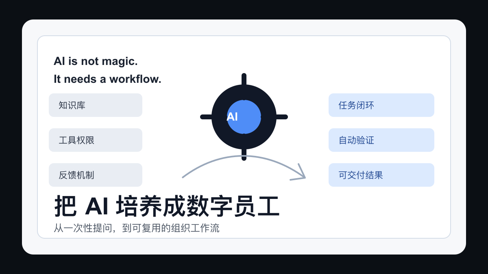
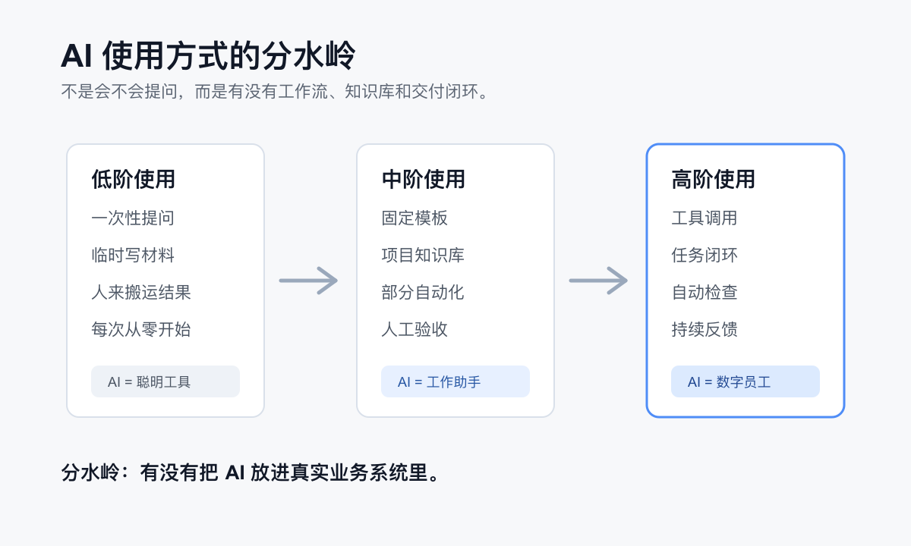

# AI 不是没有提效，是你还没把它培养成数字员工

最近我有一个越来越强烈的感受：

很多组织并不是没有 AI，也不是员工完全不会用 AI。

他们的问题是，AI 还没有真正进入工作流。

它还停留在一个很浅的位置：写写材料，改改文案，查查资料，生成几段代码，做一个看起来还不错的 PPT。大家会觉得“这个东西有点用”，但用完之后，原来的流程还是原来的流程，原来的审批还是原来的审批，原来的文件流转还是原来的文件流转。

所以很多老板会焦虑：AI 到底有没有用？为什么看起来所有人都在讲 AI，但自己的组织里好像没有发生什么本质变化？

我的判断是，AI 不是没有提效。

只是很多人还没有把它培养成一个真正能工作的“数字员工”。

## 很多人还停在低阶使用

数字生命卡兹克有一篇文章，把 AI 使用者分成了 10 个等级。我觉得这个框架很有启发。

它不是简单区分“会不会写 Prompt”，而是看一个人能不能把 AI 变成稳定的生产力系统：有没有知识库，有没有工具调用，有没有工作流，有没有反馈循环，有没有多 Agent 协作，有没有把 AI 放进真实业务闭环。

如果按这个框架看，很多人其实还停留在 3 级、4 级、5 级附近。

他们会问 AI 问题，也会让 AI 写文档、写代码、改表格。但这些动作大多是一次性的，像临时请了一个聪明实习生帮忙。

今天问一句，明天问一句。

今天让它写一段，明天让它改一个。

每次都从零开始解释背景，每次都靠人来组织资料，每次都需要人把 AI 的输出搬到下一个系统里。

这当然有价值，但它不是高阶 AI 工作方式。

真正的差距不在于你有没有打开 ChatGPT，也不在于你会不会说“请你扮演一个资深专家”。

真正的差距在于：你有没有让 AI 进入你的固定工作流。

## 写代码不等于跑通闭环

现在很多人评价 AI 的能力，还是喜欢看它能不能写代码、能不能回答问题、能不能生成一篇文章。

但我越来越觉得，这些都只是单点能力。

让 AI 写一段代码，和让 AI 完成一个真实项目，中间隔着很长一段路。

一个真实项目需要理解需求、阅读仓库、修改文件、运行命令、处理报错、检查结果、提交变更、部署上线、验证线上页面。

一篇真正能发布的文章，也不只是“写一段文字”。

它需要选题、标题、结构、资料核查、配图、平台版 Markdown、个人博客同步、多平台草稿分发、发布前检查、长期归档。

如果 AI 只能写正文，那它只是一个写作助手。

如果 AI 能从想法开始，帮你把文章写好，生成配图，存进本地知识库，发布到个人博客，再推到多个平台草稿箱，最后告诉你哪些步骤已经完成、哪些需要人工确认，那它才开始接近数字员工。

区别就在这里。

低阶使用是让 AI 完成一个动作。

高阶使用是让 AI 承担一段流程。

更高阶的使用，是让 AI 在一个不断积累的系统里，长期承担一类工作。

## 组织里的问题不是工具，而是工作流

我观察到一个现象：很多央国企、传统机构里的技术部门，不管是管理者还是普通员工，对 AI 的使用都还比较浅。

这句话不是说他们不努力，也不是说他们能力不行。

恰恰相反，很多人做事很稳，流程很熟，业务经验也很深。

问题在于，越是流程稳定的组织，越容易形成一种惯性：已有流程能跑，审批链条能走，交付标准清楚，大家就没有强烈动力去重构工作方式。

AI 对这种组织来说，最尴尬的地方在于，它不是一个简单加在旧流程上的插件。

如果你只是把 AI 放在原流程旁边，让员工偶尔问两句，它很难产生巨大的效率提升。

因为真正耗时的地方，往往不是某一段文字写得慢，而是信息分散、系统割裂、权限复杂、沟通链条长、资料无法复用、每次交付都要从头组织上下文。

AI 要想真正提效，必须进入这些地方。

它要读得懂业务文档。

它要知道项目历史。

它要能调用工具。

它要能访问合规范围内的数据。

它要知道什么能自动做，什么必须请人确认。

它要在一次次交付里沉淀经验，而不是每次都像第一次上班。

如果组织没有给它这些条件，它当然只能停留在低阶使用。

## 数字员工不是买回来就能干活

很多人对 AI 的期待其实很矛盾。

一方面，他们希望 AI 像员工一样创造价值。

另一方面，他们又不给 AI 员工应该有的训练、资料、权限和流程。

这就像招了一个清华学生，第一天把他扔到工位上，然后说：你怎么还没有给公司创造利润？

这不现实。

再聪明的人进入一个组织，也要经历业务理解、系统权限、文档学习、协作磨合、交付反馈。

AI 也是一样。

如果你想让它成为数字员工，就不能只给它一个聊天框。

你要给它知识库。

你要给它工具。

你要给它可读的业务说明。

你要给它明确的工作边界。

你要告诉它哪些动作可以直接执行，哪些动作必须请示。

你还要给它反馈，让它知道怎样的输出才算真正可交付。

这套东西搭起来之后，AI 才会从“聪明的对话框”变成“可以协作的工作节点”。

## 为什么有些人已经进入 7.5 到 8 级

如果按卡兹克那个 10 级框架，我不敢说自己已经到顶级。

但至少在一些垂直场景里，我已经能跑通接近 7.5 到 8 级的闭环。

比如内容生产这件事。

我现在不是简单让 AI 写一篇文章。

我可以把一个口述想法丢给 AI，让它先理解我的观点，再查资料、写主稿、生成平台版 Markdown、准备配图、同步个人博客、推到多个平台草稿箱，最后告诉我每一步的完成状态。

这就不是“帮我写一段文字”。

这是一个内容生产与分发系统。

再比如开发项目。

AI 可以进入仓库，读代码，改文件，跑命令，处理报错，启动本地服务，部署上线，最后用浏览器验证页面是否真的可用。

这也不是“帮我写代码”。

这是一个从需求到交付的工程闭环。

很多人觉得 AI 不能真正工作，是因为他们只试过让 AI 完成零散任务。

一旦你把知识库、工具、流程、验证和反馈都接起来，它的形态会完全不一样。

## 预算也会暴露认知

还有一个很现实的判断标准：你看一个组织有没有认真理解 AI，看它有没有真正为 AI 付费。

不是说订阅越多就越先进。

但如果一个团队到现在还主要依赖免费额度、偶尔试用、员工自己买账号，那基本说明 AI 还没有进入正式生产体系。

在 AI 时代，模型订阅、工具订阅、云端算力、知识库系统、自动化平台、数据治理，这些都不是可有可无的玩具。

它们就是新的生产资料。

一个组织如果嘴上重视 AI，但不给预算，不给工具，不给试错空间，不给流程改造权限，那它很难真正理解 AI。

高效率的公司和前沿团队，往往早就跨过了“AI 能不能用”的阶段。

他们关心的是：哪些流程可以被重构？哪些岗位可以被增强？哪些交付可以自动验证？哪些知识可以沉淀成组织资产？哪些重复三遍的事情应该被 AI 化？

而很多传统组织还停留在另一个阶段：

这个东西能不能帮我写个材料？

这个东西会不会泄密？

这个东西是不是又一个泡沫？

这些问题不是不重要。

但如果永远停在这里，就会错过真正的效率差距。

## 高效率组织已经不在同一条路上

我越来越觉得，AI 会让组织之间的效率差距变得更夸张。

过去，一个低效率组织和一个高效率组织，可能只是流程慢一点、系统旧一点、沟通成本高一点。

但在 AI 时代，这个差距会变成复利。

高效率组织会把每一次交付沉淀成模板，把每一次经验沉淀成知识库，把每一个重复动作接进自动化，把每一个可验证结果交给 Agent 检查。

低效率组织则继续在旧流程里流转文件、开会同步、人工复制粘贴、反复解释背景。

表面上看，大家都在使用 AI。

实际上，一个在训练数字员工，一个在调用智能客服。

这就是区别。

## 未来的竞争，是 AI 工作流的竞争

所以我不太认同一种说法：现在的 AI 还不能像数字员工一样真正提效。

更准确的说法是：

裸用 AI，确实很难成为数字员工。

但被工作流、知识库、工具权限和反馈机制训练过的 AI，已经可以在很多场景里承担真实工作。

未来真正有竞争力的人，不只是会问 AI 的人，而是会设计 AI 工作流的人。

未来真正有竞争力的组织，也不只是买了大模型的组织，而是能把 AI 嵌入业务流程、交付系统和组织知识的人。

AI 时代的分水岭，不是“用不用 AI”。

这个阶段已经过去了。

新的分水岭是：

你是把 AI 当工具，还是把 AI 当员工培养？

你是让它偶尔帮忙，还是让它长期参与一类工作的闭环？

你是让它每次从零开始，还是给它知识库、权限、流程和反馈？

很多人焦虑 AI 会不会替代人。

但对当下的大多数组织来说，更现实的问题可能是：

别人已经在训练数字员工了，而你还在问聊天框能不能写材料。

参考资料：

- 数字生命卡兹克：[《观察了三年，我把所有人用 AI 的水平分成了 10 个等级。》](https://www.huxiu.com/article/4857283.html)
- McKinsey：[《The State of AI: Global Survey 2025》](https://www.mckinsey.com/capabilities/quantumblack/our-insights/the-state-of-ai)
- McKinsey Global Institute：[《The economic potential of generative AI》](https://www.mckinsey.com/capabilities/tech-and-ai/our-insights/the-economic-potential-of-generative-ai-the-next-productivity-frontier)
- Federal Reserve Bank of St. Louis：[《The State of Generative AI Adoption in 2025》](https://www.stlouisfed.org/on-the-economy/2025/nov/state-generative-ai-adoption-2025)
- 新华网：[《从“盆景”到“雨林” 央企“人工智能+”从何发力？》](https://www.news.cn/fortune/20250923/a9fe2e22b55c4672b529be20ff446652/c.html)

更多项目和作品集：
https://swording-k.github.io

原文与长期更新版：
https://baojian-notionnext-blog.vercel.app/article/ai-digital-employee-workflow-gap
