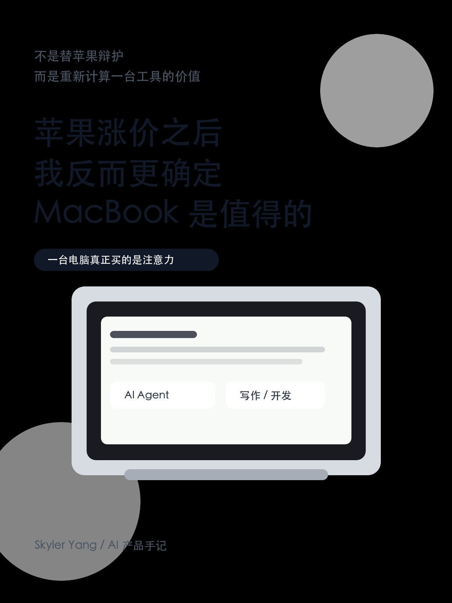
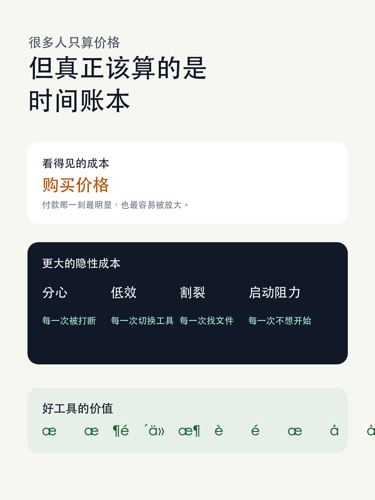
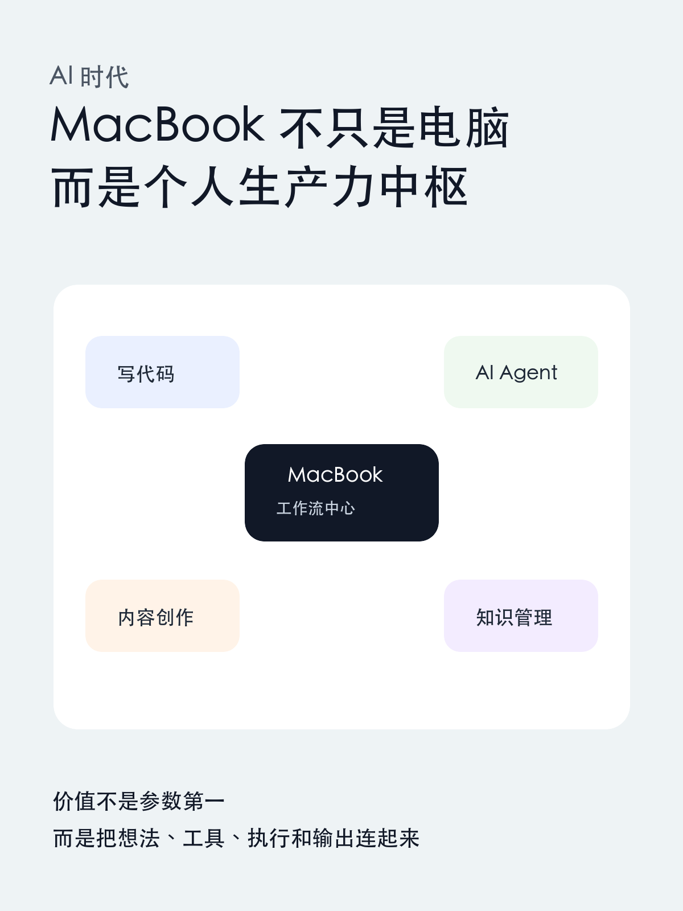

# 苹果涨价之后，我反而更确定 MacBook 是值得的

这两天看到 Apple 产品涨价的消息，很多人的第一反应是：苹果又贵了。

这个反应当然正常。任何消费品涨价，都会让人本能地重新算一次账：我是不是真的需要它？它到底值不值这个钱？

但我自己的感受刚好相反。涨价这件事反而让我更确定了一点：如果把时间、注意力、工作流和长期生产力一起算进去，Apple 产品，尤其是 MacBook，对很多人来说依然是物超所值的。

这不是一句“果粉式”的情绪表达，也不是在替一个大公司辩护。它更像是一笔很多人没有认真算过的账。

我们讨论电子产品的时候，太容易只盯着购买那一刻的价格。但真正决定一件工具值不值的，往往不是付款时肉不肉疼，而是它在接下来的几年里，能不能持续改变你的生活方式。

## 一台电脑真正的价格，不止写在发票上

MacBook 贵不贵？当然贵。

但问题是，贵不贵不能只看标价。你还要看它每天如何影响你。

如果一台电脑让你更愿意打开它，更快进入工作状态，更少被游戏、弹窗、噪音、系统维护和各种莫名其妙的摩擦打断，那它的价值就不只是硬件成本。

它是在帮你重新组织时间。

如果一部 iPhone 让你的通讯、支付、拍摄、导航、记录和设备协同都更顺，它也不只是一个更贵的屏幕。

它是在降低生活里的摩擦。

很多人说苹果贵，我不反对。但我觉得更准确的问题应该是：它有没有让你把更多时间用在真正重要的事情上？

如果答案是有，那这笔账就不能只按参数来算。

因为真正昂贵的，未必是一台电脑本身。真正昂贵的，可能是你每天被低效、分心和割裂消耗掉的时间。

## 我也曾经相信：计算机学生不要买 Mac

我是计算机学院的学生。

读大学之前，我也听过很多关于 MacBook 的说法：计算机专业别买 Mac，很多软件不能用，课程不兼容，老师用 Windows，买了会后悔。

这些话听起来都很有道理。所以一开始，我买的是一台游戏本。

游戏本当然不是坏东西。性能强，能打游戏，很多 Windows 软件也确实方便。但对我个人来说，它慢慢暴露出一个问题：它太容易把电脑变成娱乐平台。

很多时候，打开电脑本来是想学习、写代码、做项目，结果桌面环境、使用习惯和设备形态，会把人自然地拉向另一套路径。

不是说游戏本一定让人不学习，也不是说 MacBook 买了就自动自律。真正的问题是：一个工具会不会放大你原本的意图。

到了大三，我自己买了一台 MacBook。

最让我惊讶的变化，不是某个参数突然震撼我，而是我发现自己更愿意打开电脑了。

我更愿意在它上面写代码、查资料、整理笔记、做项目、写文章、研究 AI 工具。它没有替我学习，也没有替我努力，但它减少了我进入学习和创作状态之前的阻力。

也就是从那一刻开始，我突然觉得：这钱花得值。

## MacBook 的价值，是让电脑重新变成生产力入口

对我来说，MacBook 最大的价值不是“高级感”，也不是“别人看起来觉得你很专业”。

它真正改变的是电脑在我生活里的位置。

过去电脑更像一个综合娱乐设备。它能做很多事，也正因为能做太多事，所以常常把注意力分散掉。

MacBook 给我的感觉更像一个稳定的工作台。

打开盖子，进入桌面，开始写代码、记笔记、调用 AI 工具、整理文件、剪一点素材、写一篇文章。整个过程很顺，设备的存在感很低。

这种“存在感低”其实非常重要。

好的工具不是一直提醒你它有多强，而是尽量不打断你，让你的注意力留在事情本身。

对学生、开发者、自媒体创作者、产品经理，甚至任何需要长期输出的人来说，最珍贵的不是某一次爆发，而是每天都能更容易进入创作状态。

MacBook 对我的价值就在这里。

它让我从“我得逼自己坐下来学习”，变成“我愿意顺手打开电脑做点东西”。

这个变化看起来很小，但长期累积下来，差别非常大。

## 苹果生态不是炫技，而是减少摩擦

后来我慢慢有了更多 Apple 设备：iPhone、iPad、Apple Watch。

如果单独看，每一个产品都能被质疑：手机为什么这么贵？平板是不是只是大号手机？手表是不是可有可无？

但真正用久了，你会发现它们的价值不完全在单品，而在系统。

iPhone 负责生活里的高频连接，Mac 负责深度工作，iPad 适合阅读、批注和轻量创作，Apple Watch 记录身体状态，也在很多小场景里减少拿出手机的次数。

它们之间的协同不是那种发布会上看起来很酷、日常却用不到的功能。很多时候，它只是让你少一步。

少传一次文件，少登录一次账号，少找一次验证码，少切换一次设备，少被手机打断一次。

而长期生产力，往往就是由这些“不被打断”组成的。

我们太容易低估摩擦的成本。

一次打断看起来只有几十秒，但它真正消耗的是重新进入状态的时间。一个稳定、连续、少摩擦的系统，会让你把更多脑力留给思考本身。

这就是我为什么觉得 Apple 产品贵，但不是离谱地贵。

它在某种程度上定义了消费电子产品在几千到上万元这个区间里的价值感：不只是堆硬件，而是把硬件、系统、服务和人的日常节奏连接起来。

## 它像冰美式：不是药，但能让你清醒

我一直觉得，Apple 产品的价值有点像冰美式。

冰美式当然不是药。它不能直接让你变聪明，也不能直接帮你完成工作。

但如果它让你在每天早上更快清醒一点，让你更容易进入专注状态，让你在一段时间里保持更好的节奏，它就在间接服务你的认知和输出。

MacBook 也是这样。

它不是买来之后就能让人成为开发者、创作者或者更自律的人。

但如果它让你更愿意坐下来写代码，更愿意整理笔记，更愿意研究 AI 工具，更愿意把脑子里的想法变成具体作品，它就已经在发挥价值。

真正的生产力工具，往往不是通过某个惊艳功能改变你，而是通过日复一日的低阻力，把你推向更好的状态。

这也是为什么我不太愿意把 Apple 产品只理解成“消费升级”。

对很多人来说，它其实是“工作流升级”。

## AI 时代，MacBook 的价值反而更高

如果放在今天的 AI 时代，这件事会更明显。

现在的电脑不再只是办公软件和浏览器的载体。它正在变成每个人调用 AI、组织知识、搭建自动化流程、写代码、做内容、处理多模态素材的中心。

尤其是 AI Agent 开始进入日常工作之后，一台稳定、安静、续航好、生态完整、开发环境成熟的 MacBook，会变得非常关键。

你可以在上面写代码，跑本地工具，管理项目，使用命令行，让 AI 帮你读文件、改代码、生成文章、整理资料、做自动化。

它不是单纯的一台电脑，而是一个个人生产力中枢。

对开发者是这样，对自媒体也是这样，对学生也是这样。

未来每个人都需要一个属于自己的 AI 工作台。这个工作台要足够稳定，足够顺手，足够少打断，也要能承载长期积累的文件、项目、笔记和自动化流程。

在这个意义上，我甚至觉得 MacBook 是当下 AI 时代最好的生产力工具之一。

不是因为它参数永远第一，而是因为它最容易把“想法、工具、执行、输出”连成一条顺滑的链路。

## 贵不是原罪，没改变你才是

我并不是说每个人都应该买 Apple 产品。

如果你的预算有限，如果你的专业软件强依赖 Windows，如果你主要需求就是游戏，那当然应该选择更适合自己的设备。

工具没有信仰，只有匹配。

但我也不认同一种过于简单的说法：苹果就是智商税，买苹果就是为品牌溢价付钱。

至少以我自己的经历看，MacBook 改变了我使用电脑的方式。它让我更愿意学习、工作、写作、开发，也让我更早感受到一个顺滑工作流对人的影响。

它没有替我努力，但它降低了努力的启动成本。

这件事非常值钱。

所以当我看到苹果涨价的消息时，我的第一反应不是“它更贵了，所以不值了”，而是重新确认：如果一个产品能在几年时间里持续改善你的注意力、效率和输出，它的价值就不能只看购买那一刻。

真正贵的，可能不是一台 MacBook。

真正贵的，是你每天被低效、分心和摩擦消耗掉的时间。

如果一台设备能把你从这些消耗里拉回来一点点，它就已经不仅仅是一件电子产品。

它是你和更好状态之间的一座桥。
