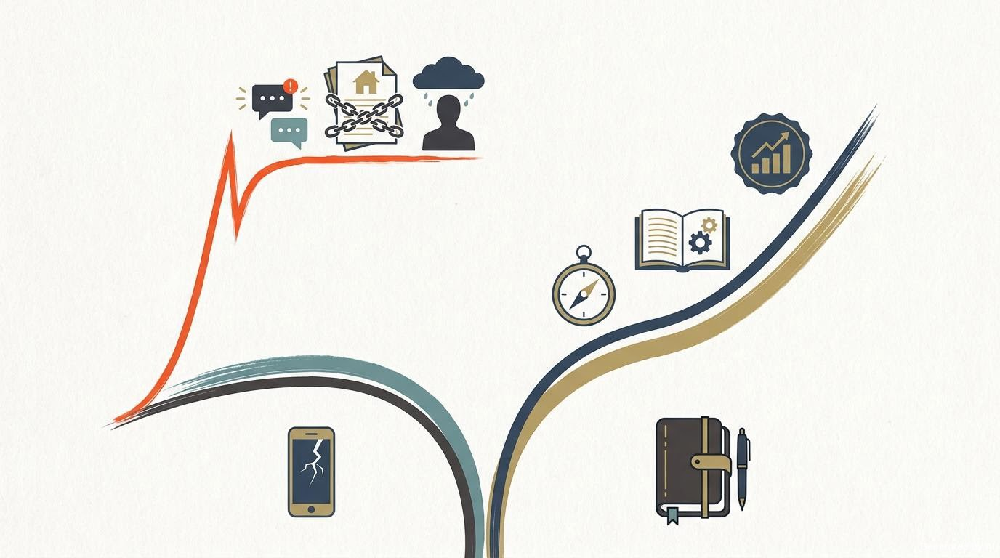

# 我今天第一次开始怀疑：我们是不是都被互联网大厂前几年的高薪滤镜骗了？

我今天刚入职一家金融机构。

第一天最强烈的感受，不是业务，不是流程，也不是“终于找到实习了”的那种轻松，而是我突然第一次非常直观地感受到，金融圈和互联网圈，对“钱”“职业路径”“生活方式”的理解，可能真的不太一样。

这种感觉很难描述。不是谁跟我讲了什么大道理，而是你站在那个环境里，会突然意识到：这里的人，好像不是按同一种职业叙事在生活。

也就是今天，我第一次开始认真怀疑：

**我们是不是都被互联网大厂前几年的高薪滤镜骗了？**

先说清楚，这不是一篇“金融一定比互联网好”的文章。

恰恰相反，在今天之前，我一直都觉得，像我这种计算机专业、想做产品、又想靠自己在大城市站稳脚跟的人，最现实、最有想象力的一条路，就是去互联网大厂。

因为那条路离高薪最近，也离“靠能力改命”最近。

我是计算机专业，之前一直在找互联网大厂、中厂，以及各种公司的产品相关实习。我的想法一直都很直接，也很现实。

如果以后想走得更高，最好能实现财富自由，哪怕退一步，至少也要靠自己的能力在大城市安家，那最像“正解”的路径，似乎就是互联网大厂产品岗。

原因也很简单。它和技术距离近，行业上限高，薪资高，平台大。如果一个人能力够强，往后不管是升职、跳槽，还是碰到创业机会，理论上都比别的路径更有想象力。

而另一边，像很多金融类央国企、传统平台型组织，在我以前的认知里，更像是一条“稳”，但不够猛的路。

说白了，我以前甚至会觉得，这种路很难真正解决一个年轻人最现实的问题：

你怎么在大城市留下来？  
你怎么靠自己的工资，去覆盖房价、生活成本和未来的家庭压力？

所以以前在我脑子里，这几乎不是一道复杂的题。互联网大厂产品岗，就是更接近高薪、更接近 upward mobility、更接近未来可能性的那条路。

但今天，我第一次开始怀疑，我是不是把职业这件事看得太短了。

以前我看这道题，更像是在看前五年。

看谁起薪更高，谁 title 更亮，谁平台更大，谁最像“年轻时候应该去拼一下”的地方。

可今天我突然开始想一个更难但也更现实的问题：

**一条职业路径，真的应该只看前五年吗？**

如果把时间拉长到三十岁、三十五岁，甚至把买房、结婚、房贷、公积金、工作强度、被裁风险、职业可持续性这些东西一起算进去，答案会不会完全不一样？

我回去特地查了几组数据，先把我自己的一个误区纠正掉。

我今天最初的直觉是：是不是互联网大厂这个行业已经整体在往下走了，所以我才会突然觉得金融这边更“值钱”。但查完之后我发现，事情没有我第一反应里那么简单。

指数、基金净值、时间区间，很多时候并不是一个口径。再加上我自己本身也买了相关基金，年内的体感很差，所以很容易把“投资体验差”直接等同成“整个行业已经不行了”。

但如果回到公司基本面去看，至少头部互联网公司并不是一个“营收一路下滑”的简单故事。腾讯 2024 年营收是 **6602.57 亿元**，同比增长 **8%**。阿里也在 2025 财年持续把电商和 `AI + Cloud` 作为核心增长引擎，2025 年 3 月季度云业务收入同比增长 **18%**，之后几个季度还在继续提速。

也就是说，**互联网大厂不是不赚钱，也不是突然不行了。** 如果我把文章写成“互联网已经不行了，金融全面更优”，那就是偷懒，也是错的。

但另一边，我觉得“大厂也在明显收缩”这件事，也不是错觉。

公开报道提到，阿里巴巴、百度的员工人数都连续几年下降。换句话说，就算头部公司还在赚钱，还在押注 AI、还在做校招，这个行业也已经不是那个只扩张、不收缩的阶段了。

所以现在更接近现实的状态可能是：**头部公司还强，但普通人的进入门槛更高，竞争更大，组织调整也更频繁了。**

但真正让我开始动摇的，不是“互联网现在赚不赚钱”，而是另一个问题：

**它们还像以前那样，代表一条对普通人长期必然更优的职业路线吗？**

这是两件完全不同的事。

一家行业龙头继续赚钱，不等于每一个进到里面的普通员工，都还能像前几年那样，分享同样厚的时代红利。

同样，一条路径前几年回报很高，也不等于它在十年尺度里，对一个普通人的生活质量、住房能力、家庭压力、职业安全感，就是最优解。

如果再把 AI 这件事放进来，我会更觉得互联网大厂现在其实也很焦虑。

财报里，腾讯自己都写了，前几个月已经重组 AI 团队、加大 AI 相关资本开支。换句话说，连最强的大厂之一，也不是在一个“高枕无忧”的状态里做 AI。

更现实的是，这两年国内最出圈、最容易引发市场讨论的模型公司，也不再只来自传统互联网巨头。MiniMax、智谱这些创业公司不断拿走关注度，本身就说明大厂在 AI 时代并不是天然稳坐牌桌中央。

我今天在金融机构里最直观的感受是，我以前可能太低估这条路的“后劲”了。

以前我总觉得，金融类央国企的问题是起步不够猛。

但今天我开始怀疑，慢未必等于差，稳也未必等于没上升空间。

尤其是券商、银行、保险这类强组织属性的行业，它的回报机制可能本来就不是前几年最亮，而是越往后越吃组织位置、平台资源、牌照能力、客户积累和制度福利。

比如公开披露的数据里，2025 年不少上市券商员工人均薪酬都在回升。以媒体基于年报可比口径统计的数据看，中信证券员工人均薪酬达到 **81.28 万元**，中国银河约 **61.61 万元**，长城证券约 **52.27 万元**。这当然不等于一个应届生进去就拿这个数，也不等于每个人都能稳定走到那一步，但它至少说明了一件事：

**金融，尤其是头部和中大型券商，并不是大家想象中那种“一眼看到头”的低薪赛道。**

这也是我今天最大的认知冲击之一。

以前我可能把“金融类央国企”这几个字，自动等同成了“稳定、普通、没什么上升弹性”。

但如果这条路在前几年虽然没有互联网大厂那么猛，可到了三十岁以后，收入开始稳步上来，福利和公积金的作用开始显现，生活节奏又没有一直处在高压波动里，那它对应的真实生活质量，可能和我以前想象的不是一回事。

说得更现实一点，很多年轻人做职业选择，最后比的不是 abstract 的理想，而是长期的真实生活：谁前几年更猛，谁三十岁以后更稳，谁更有机会在大城市真正安顿下来。

我现在也不是想唱衰互联网大厂。它依然是市场上最有吸引力的路径之一，高薪、平台、项目密度、成长速度、视野，这些都是真实存在的。

但我开始怀疑的是，它是不是把回报过于集中在职业前期了。

它最亮的部分，可能恰恰集中在二十多岁最容易让人上头的几年。可一旦时间拉长，行业增速、组织状态、岗位要求、家庭约束都会开始变，这时候值不值，就不是看前几年拿了多少，而是看后面还能不能稳得住。

甚至我现在会觉得，互联网大厂前期的高薪，某种程度上还会把人推向更激进的生活决策。比如更早去掏高首付买房，更早背上大额房贷；可一旦到了三十多岁，行业开始收缩、裁员风险上来，那种焦虑感会被放得更大。

我甚至觉得，很多人真正低估的，不是工资本身，而是**职业路径的复利结构**。

有的路，前面一次性给你很多糖；有的路，前面没那么甜，但越走越稳。前者更容易被看见，后者更容易被低估。

而这恰好也是我今天重新看金融类央国企、券商和互联网这几条路时，最在意的差别。

如果只看起薪，互联网大厂大概率还是更猛，这点我不否认。但如果看公开可见的数据，金融尤其是中大型券商也根本不是低薪路线。2025 年公开报道基于年报可比口径统计，中信证券员工人均薪酬约 **81.28 万元**，中国银河约 **61.61 万元**，长城证券约 **52.27 万元**。

我没有在文里硬写一个“互联网平均薪资对比金融高多少”的表，因为我没找到一个能横向、公允覆盖腾讯、阿里、美团、字节、快手不同职级和不同年份的统一官方口径。比起编一个看上去很爽但其实不准的数字，我宁愿把这件事写老实一点：

**互联网前期薪资冲击力更强，但金融并不是没钱，只是它的回报结构更靠后。**

但今天进入另一个行业环境之后，我第一次开始怀疑：

我们是不是把职业这件事看浅了？

我们总盯着谁起薪更高，谁前几年更风光，谁简历更漂亮，却很少认真去想，**谁更有可能在三十岁以后真正安顿下来。**

这句话听起来一点也不热血，但它可能比“年轻人要去最有挑战的地方”更接近现实。因为绝大多数普通人最后拼的，不是某一年工资包上的数字，而是一个人在大城市长期活得稳不稳。

如果从这个角度去看，我今天第一次觉得，那些过去在我眼里没那么“性感”的路径，未必不是更好的长期资产。

再说一次，我不是在下结论。我现在也只是刚入行的小白，今天看到的可能只是这个世界很小的一角。也许过几年回头看，我会发现自己今天想得太简单。

但至少今天，我第一次开始认真怀疑：

**对一个普通人来说，互联网大厂真的是那条最好的路吗？**

还是说，我们只是太容易被它前几年的高薪滤镜说服了？

也想听听大家怎么看。

尤其是已经在互联网、券商、银行、国企这些路径上真正走了几年的人。

如果把时间拉长到十年，而不是只看前五年，你还会做出同样的选择吗？

---

## 我查到的几组公开数据

1. 腾讯 2024 年年报显示，全年营收为 `660,257` 百万元，同比增长 `8%`：  
   https://static.www.tencent.com/uploads/2025/04/08/1132b72b565389d1b913aea60a648d73.pdf

2. 阿里 2025 财年和后续季度财报持续强调 `AI + Cloud` 是增长引擎，其中 2025 年 3 月季度云业务收入同比增长 `18%`：  
   https://www.businesswire.com/news/home/20250514856295/en/Alibaba-Group-Announces-March-Quarter-2025-and-Fiscal-Year-2025-Results

3. 公开报道基于上市券商年报可比口径统计，2025 年部分券商员工人均薪酬回升，中信证券约 `81.28 万元`、中国银河约 `61.61 万元`、长城证券约 `52.27 万元`：  
   https://www.stcn.com/article/detail/3739273.html  
   https://www.cls.cn/detail/2350099

4. 公开报道提到，阿里巴巴、百度员工人数连续几年下降，说明头部互联网公司在继续押注 AI 的同时，也在持续做组织收缩和人力结构调整：  
   https://m.caixin.com/m/2025-08-01/102347453.html

## 文末入口

更多项目和作品集：  
https://swording-k.github.io

原文与长期更新版：  
https://baojian-notionnext-blog.vercel.app/article/big-tech-high-salary-filter
