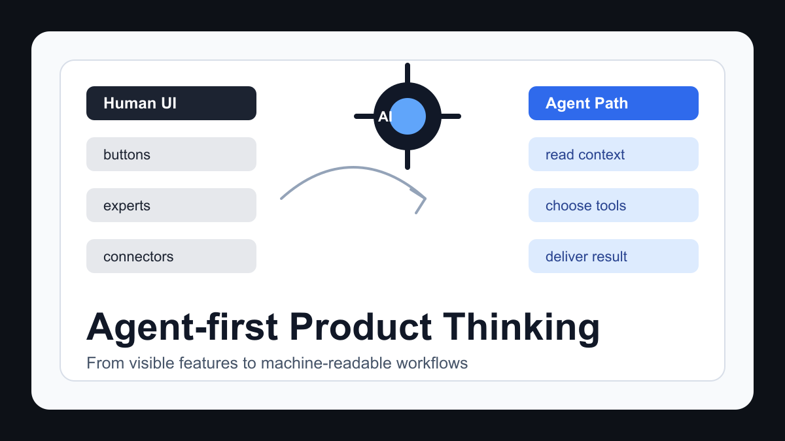
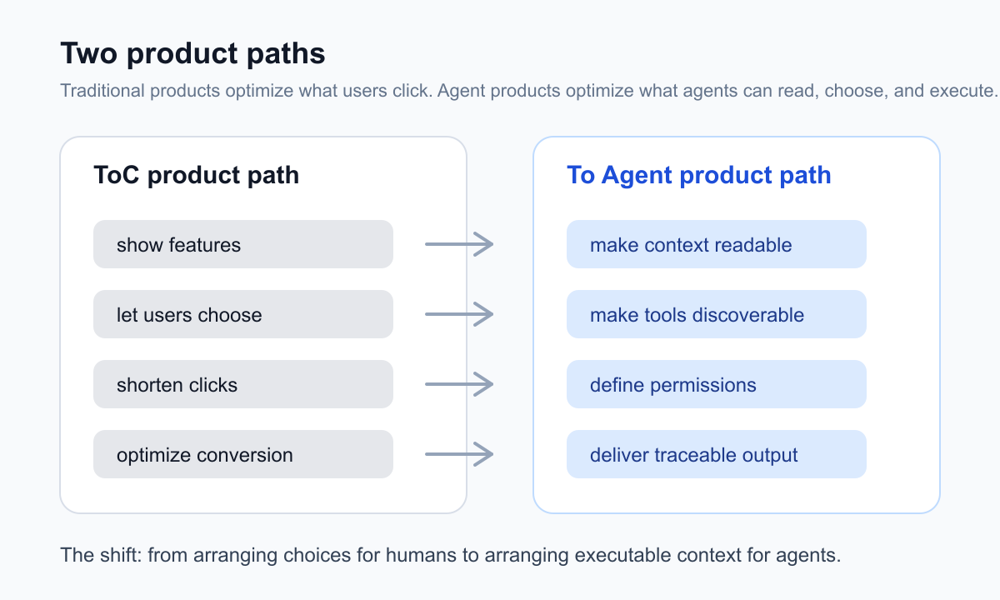

# Agent 时代，产品不能只做给人用了

最近因为实习和产品工作的关系，我重新密集体验了一轮国内外的智能体产品。用了一周多 WorkBuddy 之后，今天又切回 Codex，反而有一种工作流重新顺起来的感觉：它少让我做调度，多帮我把事情往前推。

越用越觉得，很多产品表面上已经在做 Agent，但底层仍然是上一代互联网产品的思路：把功能摆出来，把入口做清楚，把路径压短，让用户觉得选择很多、控制很多。

这套逻辑没有错。只是到了 Agent 时代，它不够了。

Agent 产品真正要回答的问题，不只是用户能不能点到功能，而是 Agent 能不能自己发现功能、判断何时使用、读懂上下文，并在用户不盯着它的时候完成大量水下工作。

如果一个产品只是把专家、连接器、插件、资料库都摆在界面上，但 Agent 自己不会选、不会调、不会组织上下文，那它仍然是一个“给人操作的工具集合”，不是一个真正面向智能体工作的系统。

这也是我最近体验 WorkBuddy 后最强烈的感受。

## Claude 和 Codex 给我的参照系

如果看全球第一梯队的智能体产品，Claude 和 Codex 仍然是两个非常重要的样本。

Claude 更像一个理解力很强的长期协作者。在复杂文档、产品判断、长文本写作和开放式推理上，它给人的感觉是：能跟得住你的脑子。

Codex 则更像一个为工程工作流重构过的智能体。它不是在聊天框里回答代码问题，而是可以进入仓库、理解目录、修改文件、运行命令、提交变更、解释结果。

这两个产品共同说明了一件事：Agent 的价值，很多时候不在台面上。

它会自己读文件、搜代码、理解项目、调用工具、跑测试、对比 diff、整理上下文。用户最后看到的只是一段回复，但回复背后已经发生了大量重慢工作。

传统聊天机器人是“我问一句，你答一句”。

真正的 Agent 是“我给你一个目标，你自己组织路径”。

## WorkBuddy 的代表性

回到国内市场，WorkBuddy 最近确实很有代表性。

它赶上了国内用户对办公智能体、桌面智能体、微信生态智能体的集中关注，也背靠腾讯生态：微信、企微、腾讯文档、腾讯云、CodeBuddy，以及越来越密集的模型和工具能力接入。

从国内产品语境看，WorkBuddy 确实是第一档。它不是简单的网页聊天框，也不是只会总结文档的 AI 助手。它至少在产品形态上，已经开始接近真正的智能体工作台。

但也正因为它有代表性，它暴露出来的问题更值得讨论。

我的感受是：WorkBuddy 很大程度上学到了 Codex 的外形，但还没有完全学到 Codex 背后的 Agent 产品思维。

## 它像 Codex，但又不像 Codex

WorkBuddy 有项目，有专家，有技能，有连接器，有文件，有任务，也有多 Agent 的概念。

从包装上看，它很像一个面向办公场景的 Codex。

但真正用起来，差异很明显。

Codex 的核心是让 Agent 自己干活。WorkBuddy 的很多设计，仍然像是在让用户自己组织功能。

它给了用户很多专家选择、专家团选择、连接器选择和项目协作入口。这些当然有价值，但如果每次都需要用户自己判断该选哪个专家、开哪个连接器、喂哪份资料、怎么描述协作方式，智能体味道就会变弱。

Agent 产品的关键，不是给用户更多选择，而是替用户承担更多选择。

这就是两代产品思维的分界线。

## ToC 产品思维遇到了新问题

我能理解腾讯团队为什么会这样设计。

腾讯太擅长 ToC 互联网产品了。

过去二十年，中国互联网产品的成功很大程度上来自一种能力：理解用户、优化入口、降低操作成本、把可感知价值放在界面上。

所以传统 ToC 产品天然喜欢把能力做得可见：

这里有专家。

这里有专家团。

这里有连接器。

这里有项目说明。

这里有很多模板。

这套逻辑在上一代产品里非常有效。

但 Agent 产品里，用户不一定应该亲自操作这些能力。把所有能力都摆给用户，让用户自己选择，本质上还是让人做调度。

而 Agent 的意义，恰恰是把人从调度里解放出来。

## Agent 产品要给智能体读

我现在越来越觉得，Agent 时代的产品要有一种新意识：

产品不只给人用，也要给 Agent 用。

这句话并不抽象。

比如一个项目协作说明，传统产品可能会做成一个漂亮 PDF。排版好看，结构清晰，适合展示，也适合汇报。

但对 Agent 来说，PDF 未必是最好的协作材料。

Agent 更需要结构化、可检索、可引用、可持续更新的上下文。比如 Markdown、JSON、API schema、MCP server、CLI help、项目级 instructions、机器可读的任务状态、可调用的工具说明。

如果一个“项目协作说明”主要是给人看的 PDF，而不是给 Agent 读的可执行上下文，它仍然是上一代产品逻辑。

传统产品问：用户看得懂吗？点得到吗？会不会用？

Agent 产品还要追问：Agent 读得懂吗？找得到吗？会不会自己决定用？

## 为什么越来越多产品开始提供 MCP 和 CLI

这个趋势已经很明显了。

很多传统产品都开始给智能体开接口、开 CLI、开 MCP。

Notion 推出了 Notion MCP，让 AI 工具可以连接 Notion 工作区，读写页面和数据库。很多云服务、开发工具、企业软件，也在提供 CLI 或 MCP，让智能体通过标准协议调用能力，而不是只让人点网页。

这件事说明，产品的“可用性”正在被重新定义。

过去，一个产品可用，是指人能打开网页、找到按钮、完成流程。

现在，还要看 Agent 能不能访问它、理解它、调用它、把它放进更大的工作流里。

未来很多产品的竞争力，可能不只是 UI 多漂亮，而是数据能不能被安全读取，动作能不能被明确调用，权限能不能被可靠管理，文档是不是机器可读，产品能不能成为别人 Agent 工作流里的一个节点。

这就是 To Agent 的产品思维。

## WorkBuddy 真正要突破什么

我不是想简单批评 WorkBuddy。

相反，我觉得它的方向是对的。

办公场景、微信生态、国产模型、桌面端、本地文件、专家模式、项目协作，这些方向都有价值。

但下一步真正要突破的，不是再多加几个专家，也不是再多接几个连接器，而是把调度权交给 Agent。

用户说“帮我分析这份竞品资料，并整理成老板能看的报告”时，系统能不能自己判断该读哪些文件、补哪些资料、调用哪个专家、使用哪个模型、生成什么格式？

用户进入一个项目空间时，Agent 能不能自己读懂项目规则，而不是让用户反复解释？

用户连接了微信、腾讯文档、资料库、本地文件之后，Agent 能不能自己判断哪些上下文相关，哪些只是噪音？

任务执行到一半，Agent 能不能自己发现缺口，并用最小打扰的方式向用户确认？

这才是 Agent 产品的核心体验。

不是“我给你很多能力，你自己选”。

而是“你给我目标，我来组织能力”。

## 下一代 Agent 产品的标准

如果让我总结，下一代 Agent 产品至少要满足五个标准。

第一，资料机器可读。说明文档漂亮不够，Agent 要能稳定读取、引用、拆解和执行。

第二，工具可发现。不是用户知道有某个连接器，而是 Agent 能根据任务自己发现它有用。

第三，权限可控。Agent 可以自动做事，但不能黑箱乱动。哪些动作能直接执行，哪些动作必须确认，要有清晰边界。

第四，过程可追踪。水下工作不能完全消失。用户不需要盯每一步，但关键时刻要知道它读了什么、做了什么、为什么这么做。

第五，产出可交付。不是聊得聪明，而是最后能给出真正可用的文档、表格、代码、报告、计划或决策建议。

把 AI 包进界面里，只是 AI 功能。

围绕 Agent 的读取、调用、规划、执行和交付重新设计，才是 Agent 产品。

## 国内 Agent 产品的机会

我对 WorkBuddy 这类国内 Agent 产品是有期待的。

国内产品有自己的优势。微信生态、企业微信、腾讯文档、本地办公习惯、中文语境、企业权限和组织协作，这些都不是海外产品能轻易复制的。

如果 WorkBuddy 能把这些生态优势和真正的 Agent 产品思维结合起来，会很有想象力。

但如果它只是把专家、插件、连接器、模板不断堆上去，它可能会变成一个复杂的 AI 办公入口，而不是一个真正能替用户完成工作的智能体。

Agent 时代最重要的变化，不是产品多了一个聊天框。

而是产品开始拥有一个新的使用者：智能体本身。

未来的好产品，不仅要让人用起来舒服，也要让 Agent 调用起来可靠。

这会改变产品经理的很多基本判断。

以前我们设计用户路径。

以后还要设计 Agent 路径。

以前我们写帮助文档。

以后还要写机器可读的协作协议。

以前我们优化点击转化。

以后还要优化任务完成率、工具调用成功率、上下文召回质量和自动执行边界。

这是我最近做产品工作时最大的感受：

AI 时代的产品，不只是 ToC，也不只是 ToB。

它还要 To Agent。

更多项目和作品集：
https://swording-k.github.io

原文与长期更新版：
https://baojian-notionnext-blog.vercel.app/article/workbuddy-agent-product-thinking
